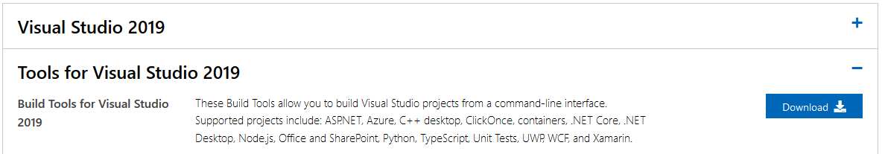
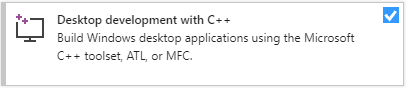
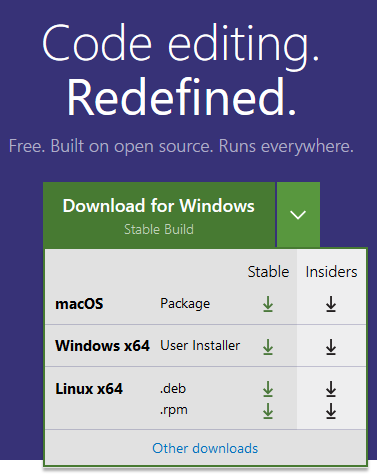

# Getting started with OpenCL on Microsoft Windows

OpenCL is not native to the Windows operating system, and as such isn't supported across the board of UWP (Universal Windows Platform) platforms (XBox, Hololens, IoT, PC) and the Microsoft Store. Windows as a traditional content creating platform however can build and execute OpenCL applications when built as traditional Win32 GUI or console applications.

_(NOTE: Nothing prevents from using advanced WinRT capabilities to use the ICD in packaged applications (APPX/MSIX), however such applications will most certainly not be able to load a functioning OpenCL runtime on platforms other than PC and a few IoT devices.)_

In this guide we're going to use the following tools:

- C/C++ compiler (MSVC & LLVM)
- CMake (Cross-platform Make)
- Git
- Vcpkg (Cross-platform pacakge management)
- The command-line
- Visual Studio Code

Steps will be provided to obtain a minimal and productive environment.

## Installation

Because most tools we'll be using are not found inside the Microsoft Store, we'll be installing dependencies from various places.

_(NOTE: The author **is** familiar with the Chocolatey project, however have found that the end-user UX on this particular scenario is not worth the effort. Far better UX could be achieved if these few tools were packaged as MSIX and distributed via the Microsoft Store.)_

### C/C++ compiler

From https://visualstudio.microsoft.com/downloads/ select [Build Tools for Visual Studio 2019](https://visualstudio.microsoft.com/thank-you-downloading-visual-studio/?sku=BuildTools&rel=16)

and launch the installer. When prompted which components to install, select the feature pack named "Desktop development with C++".

Among the individual features list, select `C++ CMake tools for Windows` and `Clang compiler for Windows` for convenience. The prior will install CMake, our choice of cross-platform build system, while the latter will be useful when we wish to test natively, if our host code conforms closer with ISO standards.

### Git

### Vcpkg

UX for obtaining dependencies for C/C++ projects has improved dramatically in the past few years. This guide will make use of Vcpkg, a community maintained repo of build scripts for a rapidly growing number of open-source libraries.

https://github.com/microsoft/vcpkg.git

### Visual Studio Code

While the compiler installs, you may also fetch the installer of Visual Studio Code from code.visualstudio.com

